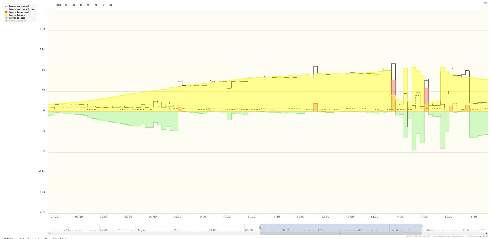

This app provides an easy way to control the charging features of your tesla. It is intended to being used in a smart home or via commandline. 

## Features

 - Start and stop charging

 - Set the charging amps

 - Set the charging limit in percent

 - Retrieve charging infos from the car

 - Open/close the chargeport

 - Set the charging limit in percent

 - Wake the car up

 - Automatically calculates the recommended charging amps based on the given power currently sent to the grid (positive values) or bought from the grid (negative values). 
The superflous power will be used to charge the car. Power already used to charge the car will be taken into account. 

This is how it looks like (The car has been charged from 09:30 to 2pm. Note how the load - the black line - follows the production - the yellow area):

## Compilation

As usual for java download *JDK* and *maven* and compile the code with

    mvn install
    
Grab the .jar file in the *target/* directory.

Alternatively you can download the teslacharging.jar file directly from the resources directoy. 

## Usage

Start the application with 

	java -jar teslacharging.jar -h
	
A short helpfile will be displayed. 

	java -jar teslacharging.jar --propertyfile /media/usb0/app.properties --chargecalculation 5000
	
Changes the charging settings of your tesla so that an additional 5000 Watts are charged on top of the current charging.

Charging can vary between 1 amps and 32 amps. Note however that even when setting to 1 amps your tesla may consume more than one amp. 
On the other side 32 amps is not always supported. Sometimes 16 amps are the maximum consumable power although the software allows up to 32 amps.

## Setup

	java -jar teslacharging.jar --auth step1

Execute the given URL in the browser, logon in the browser. When the browser shows "Page Not Found", copy the parameter "code" from the url and execute step 2 with it.

Step2 will save the necessary tokens to the configurationfile. The default location of the configurationfile is *"app.properties"*. 
This can be configured with the parameter *"--propertyfile <path_and_filename>"*. Note that the app needs write-access to the file.

Alternative to create a token:

https://github.com/fredli74/fetch-tesla-token

Grab it and enter the token in the configurationfile. 

## Special tipps

If you have more than one car enter the VIN of the car in the configurationfile. The rest will be filled out automatically.
You can use multiple propertyfiles for multiple cars.

## Contribution

Feel free to enhance the program as needed and create PullRequests so that others can benefit from your enhancements.

## Credits

**Source inspired by**

[https://github.com/rrarey02/TeslaRTPCharging](https://github.com/rrarey02/TeslaRTPCharging)

**Tesla API documentation (unofficial):**

[https://tesla-api.timdorr.com](https://tesla-api.timdorr.com)

If you want to check out python and different usecases for tesla you may want to visit

[https://github.com/strmotors/TeslaReport](https://github.com/strmotors/TeslaReport)

## Disclaimer

We are not liable for any damage or any functionality of this app. The app is provided as-is. Use at your own risk.

## License

Apache-2.0 license
